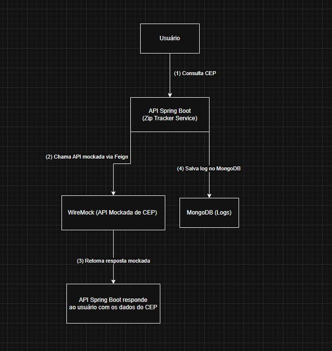

# API de Monitoramento de Consulta de CEP

## 📌 Sobre o Projeto
Esta aplicação permite a busca de endereços a partir de um CEP, consumindo uma API externa mockada via Wiremock. Todas as consultas são registradas em um banco de dados, incluindo o horário da requisição e os dados retornados.

## 🏗️ Arquitetura da Solução

A arquitetura segue os princípios SOLID e está dividida em:
- **Controller**: Exposição dos endpoints REST.
- **Service**: Lógica de negócio para busca de CEP e armazenamento de logs.
- **Client**: Consumo de endpoint externo para busca de CEP mockado.
- **Wiremock**: Simulação da API externa de CEP.
- **Model**: Camada de criação de Entidades para o Banco de Dados.
- **Repository**: Persistência dos logs de consulta.
- **Banco de Dados**: Armazena logs das consultas.



## 🚀 Tecnologias Utilizadas
- **Java 21**
- **Spring Boot**
- **Wiremock**
- **MongoDB**
- **Docker e Docker Compose**
- **AWS CloudWatch**

## 📦 Como Executar o Projeto

### ✅ Pré-requisitos
- Docker instalado
- Java 21 e Gradle instalados

### 🔧 Passo a Passo
1. Clone o repositório:
   ```bash
   git clone https://github.com/matheusPierro/zip-tracker.git
   cd zip-tracker
   ```
2. Suba os containers do banco de dados e mock da API:
   ```bash
   docker-compose up -d
   ```
3. Execute a aplicação via Maven:
   ```bash
   ./gradlew bootRun
   ```
4. Acesse os endpoints da API:
   ```bash
   curl http://localhost:8080/cep/01001-000
   ```
5. Validação dos Logs no Banco de Dados:
   ```bash
   docker exec -it mongo_db mongosh
   
   use cepdb
   
   db.cep_logs.find().pretty()
   ```
## 📝 Endpoints Disponíveis

| Método | URL                  | Descrição               |
|--------|----------------------|-------------------------|
| GET    | `/cep/{cep}`         | Retorna os dados do CEP |

## 📊 Estrutura do Banco de Dados

Os logs das consultas de CEP são armazenados com os seguintes campos:

- **_id**: Identificador único do documento no MongoDB.
- **cep**: CEP consultado.
- **logradouro**: Nome da rua ou praça correspondente ao CEP.
- **bairro**: Bairro correspondente ao CEP.
- **cidade**: Cidade onde o CEP está localizado.
- **estado**: Estado onde o CEP está localizado.
- **consultaHora**: Data e hora da consulta no formato ISODate.
- **_class**: Classe Java que representa o documento no Spring Data MongoDB.

### 🔍 **Exemplo de Registro no Banco**
```json
{
    "_id": ObjectId("67d45f7dc78207645b606144"),
    "cep": "01001-000",
    "logradouro": "Praça da Sé",
    "bairro": "Sé",
    "cidade": "São Paulo",
    "estado": "SP",
    "consultaHora": ISODate("2025-03-14T16:55:25.914Z"),
    "_class": "com.matheuspierro.zip_tracker.model.CepLog"
}
```

## 📢 Apresentação


## 📎 Repositório
[GitHub - Link para o projeto](https://github.com/matheusPierro/zip-tracker)

---
✉️ Qualquer dúvida, entre em contato!

- **Email** - matpierro570@gmail.com
- **Whatsapp** - (11)961065956

